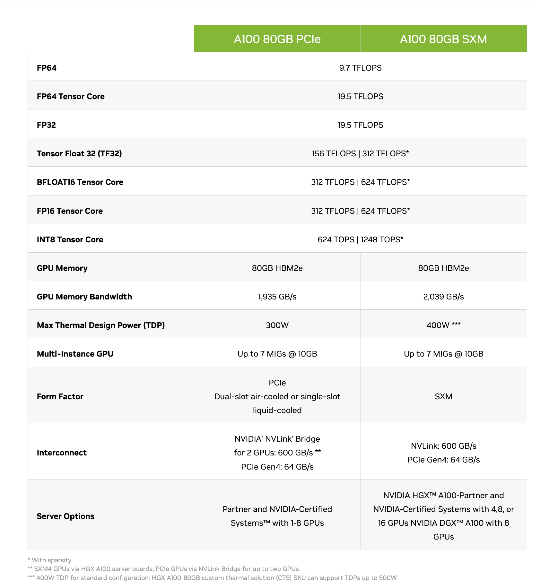
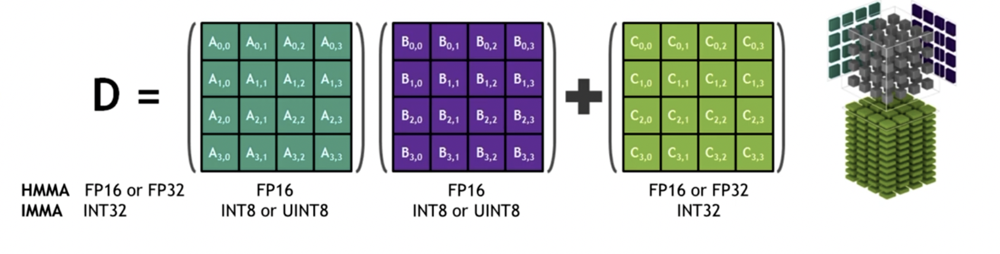
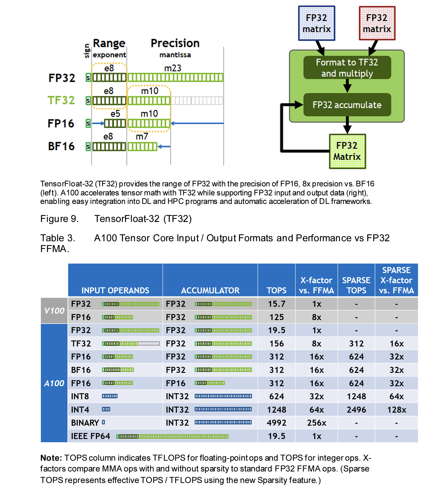
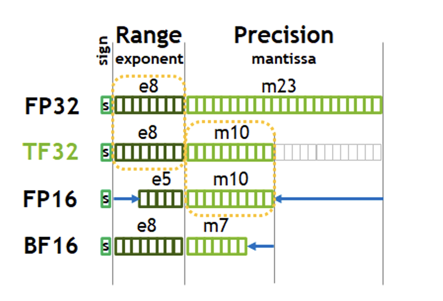

# 关于A100GPU参数

- A100GPU支持的最高精的度浮点数类型是 **float64 (FP64)**, 此时它的算力是 `9.7 TFLOPS`, 这表示它一秒内能做 9.7 trillion 次 64位浮点数的浮点运算
  - 如果是转换成 Tensor Core 专用的数据类型的话(**同样是64位浮点数**, 应该是表示数值的方法不一样, 遵循的标准不一样), 它的算力是 `19.5 TFLOPS`, 这表示它一秒内能做 19.5 trillion 次 64位浮点数的浮点运算
- 如果精度降低一些, 使用 **float32 (FP32)**, 它的算力是 `19.5 TFLOPS`, 这表示它一秒内能做 19.5 trillion 次 32位浮点数的浮点运算
  - 使用Tensor Core专用的数据类型的话, 它的算力是 `156 TFLOPS`, 这表示它一秒内能做 156 trillion 次 32位浮点数的浮点运算 (右侧带星号的数值312指的是 稀疏表示 的情况, 大部分情况下如果不进行针对性优化是不关注这个数值的)
- 从32位精度下降到 16 位(半精度)的话, 就是 `BFLOAT16 Tensor Core`类型, 对应的算力是 `312 TFLOPS`, 这表示它一秒内能做 312 trillion 次 16位浮点数的浮点运算
  - 同样, BFP16 也有对应的 Tensor Core 类型, 不过此时的算力是相同的.
- 对于 INT8 类型, **它只能用在 inference 阶段, 不能用于模型训练**, 它的算力是 `624 TFLOPS`, 这表示它一秒内能做 624 trillion 次 8位整数的整数运算.

在训练模型的时候, 如果我们从 nvidia-smi 命令中看到 GPU 的util百分比不高的话, 说明GPU大部分时间是在等待数据的加载, 而不是在进行浮点数计算.

GPU的FLOPS通常指的是`乘,加运算`, 也就是做矩阵乘法的时候的一次加法和一次乘法.
- GPU在做矩阵乘法时, 为了使效率更高, 通常会将大矩阵拆分成4x4的小矩阵进行相乘, 然后再拼回一个大矩阵, 如下:
    

## 关于参数讲解中TF32与FP32在算力上的区别
- 从下图的上半部分可以看到, TF32 和 FP32 只是在精度位数上存在区别, TF32的精度位数从23位截断到10位.  
    
  - A100 GPU 在矩阵乘法运算中, 虽然 Input 和 Output 使用的都是 FP32 的数据表示方法, 但是在进行`乘法`的时候将精度截断了10位, 使得精度降低但速度变快, 然后到累加器中, 使用仍然是FP32, 维持乘法输出的精度.
  - 图片来自[A100GPU架构白皮书](https://images.nvidia.com/aem-dam/en-zz/Solutions/data-center/nvidia-ampere-architecture-whitepaper.pdf)

在使用 A100 GPU时, 我们只需要在代码中设置`torch.set_float32_matmul_precision("high")`, 就能让矩阵乘法加速, 不过同时也会带来精度上的损失.
- 注意: 这只是在矩阵乘法的中间过程中短暂地使用了TF32类型, 在整个网络的任意位置查看参数`dtype`的时候仍然是 FP32 类型.
```python
# train model
import time
train_loader = DataLoaderLite(B=4, T=32)  # batch size 尽可能使用2的倍数, 因为硬件都是2进制, 这样可以让机器运行效率高一些

torch.set_float32_matmul_precision("high")  # hight: 做乘法的时候使用TF32(精度下降), highest: 做乘法的时候仍然使用FP32
                                                # 只在 A100之后 的N卡上有用, 在mac上无效

for i in range(50):
    t0 = time.time()
    x, y = train_loader.next_batch()
    x, y = x.to(device), y.to(device)
    optimizer.zero_grad()     # 一定以及 清空历史 梯度!!!
    logits, loss = model(x, y)
    
    # import code; code.interact(local=locals())   # 通过这行代码, 我们可以在终端触发一个 interactive console, 直接进行一些debug操作
    
    loss.backward()    # 计算梯度
    optimizer.step()   # 更新参数
    
    # torch.cuda.synchronize()   # wait for GPU to finish work (只有在N卡上有用, mac上无效)
    
    t1 = time.time()
    dt = (t1 - t0) * 1000 # time difference in miliseconds
    tokens_per_sec = (train_loader.B * train_loader.T) / (t1 - t0)
    print(f"step {i}, loss: {loss.item()}, dt: {dt:2f}ms, tok/sec: {tokens_per_sec}")   # loss.item() 可以将tensor换成为 float, 并把数据放回CPU

import sys; sys.exit(0)   # 代码走到这里就会停止, 这是一个debug的时候比较不错的方式
```

## 关于FP16与BF16
FP16数据类型是 **30系列显卡之前默认使用的数据类型** (安培架构之前的显卡), 但是在安培架构之后, 虽然也可以使用FP16数据类型, 不过此时的FP16数据类型其实是`BFLOAT16(BF16)`, 也就是**精度上只有7位**, 但是BF16其实是能覆盖到32位数字的(这可以从数据表示的 Range 字段可以看到), 如果用我们平时表示的数字来说, 它其实有32位小数, 只不过第16位小数之后的数值都是0.
- 也就是说, 2080Ti显卡的 FP16 是真正的FP16, 此时它的数据范围只有16位 (Range字段只有5位, 它无法覆盖到32位数字), 用我们平时的数字表示来描述, 它的小数位数就只有16位.


### 使用混精度训练模型以启用BF16
pytorch 官方示例:
```python
for epoch in range(0): # 0 epochs, this section is for illustration only
    for input, target in zip(data, targets):
        # Runs the forward pass under ``autocast``.
        with torch.autocast(device_type=device, dtype=torch.float16):
            output = net(input)
            # output is float16 because linear layers ``autocast`` to float16.
            assert output.dtype is torch.float16

            loss = loss_fn(output, target)
            # loss is float32 because ``mse_loss`` layers ``autocast`` to float32.
            assert loss.dtype is torch.float32

        # Exits ``autocast`` before backward().
        # Backward passes under ``autocast`` are not recommended.
        # Backward ops run in the same ``dtype`` ``autocast`` chose for corresponding forward ops.
        loss.backward()
        opt.step()
        opt.zero_grad() # set_to_none=True here can modestly improve performance
```
- 代码来自 [pytorch官方手册](https://pytorch.org/tutorials/recipes/recipes/amp_recipe.html#:~:text=Adding%20torch.&text=autocast%20serve%20as%20context%20managers,improve%20performance%20while%20maintaining%20accuracy)

- 官方提到的注意事项
  - 来自[官方手册](https://arc.net/l/quote/kdnbwhfg)
  - [x] 在 torch.autocast() 代码块中, Tensor 可能会变成任何数据类型
  - [x] 基于上一点, 只在`模型的 forward 阶段` 和 `计算 loss 阶段` 可以用 torch.autocast() 来加速
  - [x] 虽然我们的目的是希望GPU能在恰当的时候使用BF16类型, 但是**不要使用** `half()` 或者 `bfloat16()`, 直接用 `torch.autocast()` 就好 


---

在模型中, 并非所有的 layer 都支持转成 BF16, 甚至有些都只支持FP32
CUDA中支持 float16 的 layer:
```text
__matmul__, addbmm, addmm, addmv, addr, baddbmm, bmm, chain_matmul, multi_dot, conv1d, conv2d, conv3d, conv_transpose1d, conv_transpose2d, conv_transpose3d, GRUCell, linear, LSTMCell, matmul, mm, mv, prelu, RNNCell
```

CUDA中支持 float32 的 layer:
```text
__pow__, __rdiv__, __rpow__, __rtruediv__, acos, asin, binary_cross_entropy_with_logits, cosh, cosine_embedding_loss, cdist, cosine_similarity, cross_entropy, cumprod, cumsum, dist, erfinv, exp, expm1, group_norm, hinge_embedding_loss, kl_div, l1_loss, layer_norm, log, log_softmax, log10, log1p, log2, margin_ranking_loss, mse_loss, multilabel_margin_loss, multi_margin_loss, nll_loss, norm, normalize, pdist, poisson_nll_loss, pow, prod, reciprocal, rsqrt, sinh, smooth_l1_loss, soft_margin_loss, softmax, softmin, softplus, sum, renorm, tan, triplet_margin_loss
```
- [官方说明链接](https://arc.net/l/quote/vrimscaw)

---

GPT-2 模型中, 使用方式为:
```python
# train model
import time
train_loader = DataLoaderLite(B=4, T=32)  # batch size 尽可能使用2的倍数, 因为硬件都是2进制, 这样可以让机器运行效率高一些

torch.set_float32_matmul_precision("hi gh")  # hight: 做乘法的时候使用TF32(精度下降), highest: 做乘法的时候一直使用FP32
                                                # 只在 A100之后 的N卡上有用, 在mac上无效

for i in range(50):
    t0 = time.time()
    x, y = train_loader.next_batch()
    x, y = x.to(device), y.to(device)
    optimizer.zero_grad()     # 一定以及 清空历史 梯度!!!
    
    with torch.autocast(device_type=device, dtype=torch.bfloat16):  # mac不支持, 只有安培架构(30系列显卡)之后才支持
        logits, loss = model(x, y)
    
    # import code; code.interact(local=locals())   # 通过这行代码, 我们可以在终端触发一个 interactive console, 直接进行一些debug操作
    
    loss.backward()    # 计算梯度
    optimizer.step()   # 更新参数
    
    # torch.cuda.synchronize()   # wait for GPU to finish work (只有在N卡上有用, mac上无效)
    
    t1 = time.time()
    dt = (t1 - t0) * 1000 # time difference in miliseconds
    tokens_per_sec = (train_loader.B * train_loader.T) / (t1 - t0)
    print(f"step {i}, loss: {loss.item()}, dt: {dt:2f}ms, tok/sec: {tokens_per_sec}")   # loss.item() 可以将tensor换成为 float, 并把数据放回CPU

import sys; sys.exit(0)   # 代码走到这里就会停止, 这是一个debug的时候比较不错的方式
```

